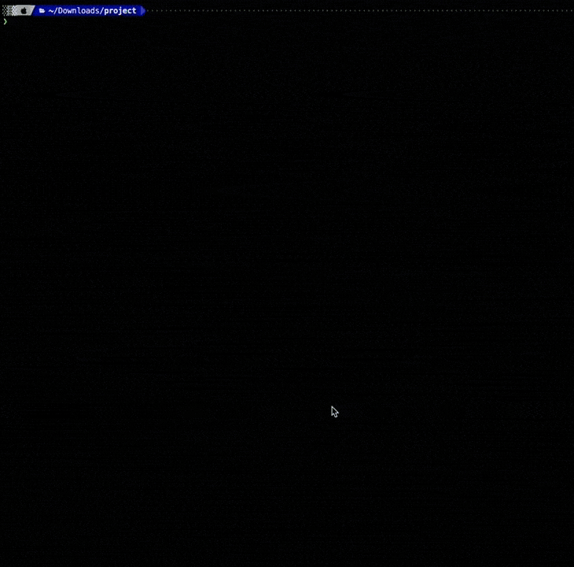
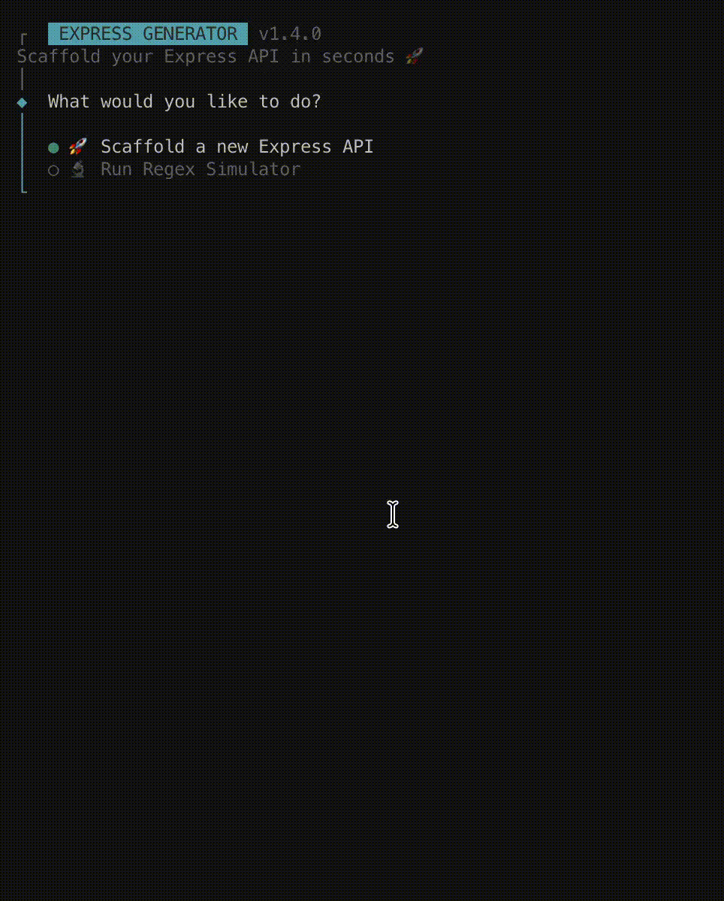
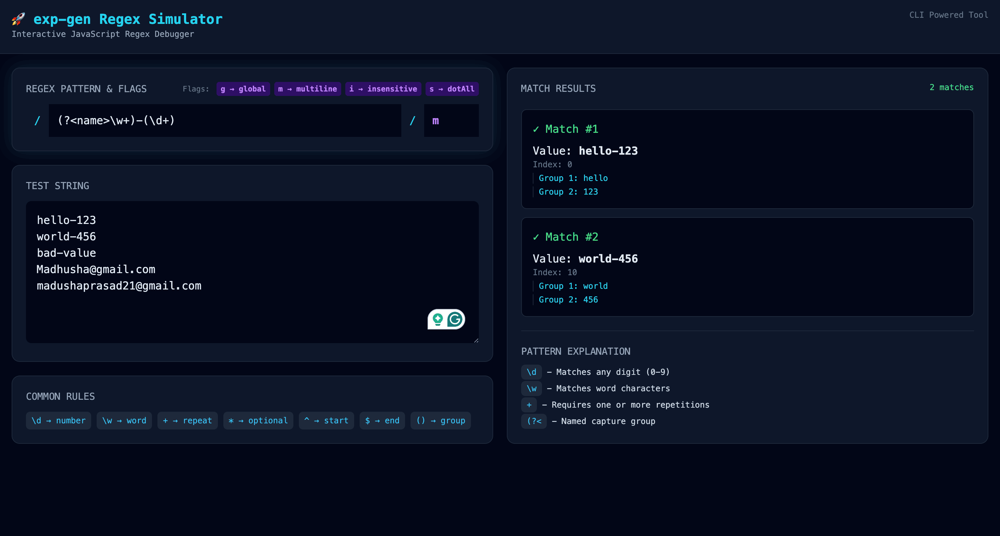

# exp-gen 🚀

[](https://www.npmjs.com/package/@madhusha_99/exp-gen)

**exp-gen** a lightning-fast, interactive CLI tool designed to scaffold **Express.js REST APIs** in seconds.

Whether you're starting a project with **TypeScript** or **JavaScript**, `exp-gen` generates a clean layered architecture, configures your preferred database boilerplate so you can start coding immediately, and now includes a **built-in web-based Regex Simulator** to help you build and debug regular expressions visually.

---

## ✨ Features

- 🚀 Interactive CLI powered by `@clack/prompts`
- ⚡ Scaffold Express.js APIs in seconds
- 🟦 TypeScript support
- 🟨 JavaScript support
- 🗂 Professional layered architecture
- 🍃 MongoDB (Mongoose)
- 🐬 MySQL
- 🪶 SQLite
- 🐘 PostgreSQL (JavaScript projects)
- 📦 Optional automatic dependency installation
- 🔬 Built-in **Regex Simulator**
- 🌐 Opens automatically in your browser
- 🎨 Modern developer-friendly UI
- 📖 Live regex explanation & validation

---

# 🚀 Installation

Install globally using npm:

```bash
npm install -g @madhusha_99/exp-gen
```

---

# 🚀 Usage

After installation you can launch the CLI using any of the following commands:

```bash
exp
```

or

```bash
gen
```

or

```bash
express-draft
```

When the CLI starts you'll be greeted with an interactive menu.

```
🚀 Scaffold a new Express API

🔬 Run Regex Simulator
```

---

# 🚀 Scaffold Express API

Choose **Scaffold a new Express API** and answer a few questions.

The CLI will ask for:

- Project name
- Language
- Database
- Install dependencies

Supported languages

- **TypeScript** _(Recommended for type safety)_ – Currently available with **MongoDB (Mongoose)** and **No Database** templates. More database integrations will be added in future releases.
- **JavaScript** – Full template support for all currently available databases, including **MongoDB (Mongoose)**, **MySQL (mysql2)**, **SQLite (sqlite3)**, **PostgreSQL (pg)**, and **No Database**.

## 🗄️ Supported Databases

| Database            | JavaScript | TypeScript | Driver / ORM | Status  |
| ------------------- | :--------: | :--------: | ------------ | :-----: |
| MongoDB             |     ✅     |     ✅     | Mongoose     | Stable  |
| MySQL               |     ✅     |     ❌     | mysql2       | Stable  |
| SQLite              |     ✅     |     ❌     | sqlite3      | Stable  |
| PostgreSQL          |     ✅     |     ❌     | pg           | Stable  |
| None (No Database)  |     ✅     |     ✅     | —            | Stable  |
| Prisma (MongoDB)    |     🚧     |     🚧     | Prisma ORM   | Planned |
| Prisma (MySQL)      |     🚧     |     🚧     | Prisma ORM   | Planned |
| Prisma (PostgreSQL) |     🚧     |     🚧     | Prisma ORM   | Planned |
| Prisma (SQLite)     |     🚧     |     🚧     | Prisma ORM   | Planned |

#### Preview



---

## 📁 Project Structure

- **`configs/`**: Environment variables and database connection logic.
- **`controllers/`**: Bridges the routes and the business logic; handles requests/responses.
- **`dtos/`**: Data Transfer Objects for validating and shaping incoming data.
- **`interfaces/`**: TypeScript interfaces and types for strict type safety.
- **`middlewares/`**: Custom Express middlewares (Auth, Error handling, Logging).
- **`models/`**: Database schemas (e.g., Mongoose/MongoDB models).
- **`repositories/`**: The data access layer; handles direct database operations.
- **`routes/`**: API endpoint definitions and mapping to controllers.
- **`services/`**: Core Business Logic layer; where the heavy lifting happens.
- **`utils/`**: Shared helper functions and utility classes.
- **`app.ts`**: The application entry point.

The generated architecture **follows a clean layered design making projects easier to maintain and scale.**

---

# 🔬 Regex Simulator

Starting from **v1.4.0**, `exp-gen` includes a fully interactive **Regex Simulator**.

Simply choose:

```
🔬 Run Regex Simulator
```

The CLI automatically starts a lightweight local server and opens the Regex Simulator in your default web browser.

> ✅ **No additional dependencies are required.** The simulator is built into `exp-gen` and runs entirely on your local machine.

#### Preview





---

## Features in Regex Simulator

- ⚡ Live regex matching
- 📖 Regex rule explanations
- 🎯 Capture group visualization
- 🔍 Match position detection
- 🚨 Friendly validation errors
- 🧠 Beginner-friendly regex guidance
- 🏷 Regex flag helper
- 🌙 Modern dark developer UI
- 🌐 Runs completely locally

**Example**

```regex
(?<name>\w+)-(\d+)
```

**Input:**

```
hello-123
world-456
invalid-value
```

**Output:**

```
✓ Match 1
hello-123

Group 1:
hello

Group 2:
123
```

**The simulator also explains regex tokens such as:**

| Token       | Description         |
| ----------- | ------------------- |
| `\d`        | Digit               |
| `\w`        | Word character      |
| `.`         | Any character       |
| `+`         | One or more         |
| `*`         | Zero or more        |
| `?`         | Optional            |
| `^`         | Start of input      |
| `$`         | End of input        |
| `()`        | Capture group       |
| `(?<name>)` | Named capture group |

---

# 🚀 Example Workflow

```bash
exp
```

```
✔ What would you like to do?

❯ 🚀 Scaffold a new Express API
  🔬 Run Regex Simulator
```

or

```
✔ What would you like to do?

  🚀 Scaffold a new Express API
❯ 🔬 Run Regex Simulator
```

---

# 📦 After Scaffolding

Navigate into your project

```bash
cd my-project
```

If dependencies were installed

```bash
npm run dev
```

Otherwise

```bash
npm install
npm run dev
```

---

## 🤝 Contributing

**We love open source! `exp-gen` is a community-driven project, and we welcome contributions to make it better.**

You can help by:

- Adding new database templates
- Improving generated project templates
- Improving the Regex Simulator
- Reporting bugs
- Suggesting new CLI features

**Clone the project**

```bash
git clone https://github.com/Open-Core-Lab/exp-gen.git
```

**Install dependencies**

```bash
npm install
```

**Run locally**

```bash
npm run dev
```

---

# 📋 Roadmap

**Upcoming features include:**

- **Prisma support**
- **Docker template generation**
- **JWT Authentication template**
- **Swagger/OpenAPI generation**
- **Testing templates (Vitest/Jest)**
- **Redis integration**
- **Prisma PostgreSQL template**
- **Environment profile generator**
- **More Regex Simulator utilities**

---

## ⭐ Support

If you enjoy using **exp-gen**, consider giving the repository a ⭐ on GitHub.

It helps the project grow and supports future development.

**Repository: [exp-gen](https://github.com/Open-Core-Lab/exp-gen)**

---

# 📄 License

This project is licensed under the **[MIT License](https://github.com/Open-Core-Lab/exp-gen/blob/main/LICENSE)**.

**Happy coding! 🚀**

_Maintained with ❤️ by [Madhusha Prasad](https://github.com/MadhushaPrasad)_
